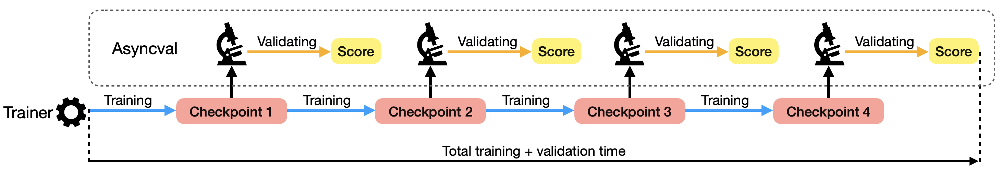

# Asyncval
[Asyncval: A toolkit for asynchronously validating dense retriever checkpoints during training.](https://arxiv.org/abs/2202.12510)

Validating dense retriever checkpoints during training is time-consuming. Asyncval is a toolkit that aims to accelerate this process. Asyncval decouples the validation loop from the training loop, uses another GPU to automatically validate new DR checkpoints generated during training, thus permitting  validation to be performed asynchronously from training.



## Installation
For [Tevatron](https://github.com/texttron/tevatron) users: `pip install asyncval`
 
For customized dense retriever encoders, clone this repo and install as editable:

```
git clone https://github.com/ielab/asyncval.git
cd asyncval
pip install --editable .
```
> Note: The current code base has been tested with, `torch==1.10.0`, `transformers==4.16.2`, `datasets==1.16.1`, `faiss-cpu==1.7.1`, `python==3.7`, `ir_measures==0.2.3`

## Preparation
To be able to use Asycval to validate your dense retreiver checkpoints, there are only two things you need to prepare:

### (1) Prepare the corpus and the validation query files
Corpus and validation query files are to be in **JSON** format; specifically each line in the file is a JSON object that represents a passage or a query:

```
{"text_id": str, "text": List[int]}
```
where `text_id` is a unique id for a passage or query in the corpus or query file, and `text` is a list of integers representing the token ids of the passage or query. 

Note the `text` field can also be the raw string of passage or query, however, we suggest Asyncval’s users to pre-tokenize their passages and queries and thus supply only token ids because Pre-tokenizing all text at once can speed up validation as there is no need to tokenize the same query and passage for each model checkpoint.

### (2) Rewrite DenseModel Class in [`src/asyncval/modeling.py`](./src/asyncval/modeling.py). (Tevatron users can skip this step)
After the corpus and query file are prepared, a python class called `DenseModel` needs to be defined; 

Rewrite the `__init__` constructor method to intital your dense retriever encoder model. This method should take the checkpoint path and the pre-defined `AsyncvalArguments` as inputs. In [`AsyncvalArguments`](./src/asyncval/arguments.py) we pre-defined several useful arguments that can be passed via command line.

Rewrite `encode_passage` and `encode_query ` methods to encode queries and passages into dense vectors.
These two methods should take a dictionary of key and values as input, where keys are Huggingface transformers input keys such as `input_ids` and `attention_mask` and values are batched token ids and an attention mask matrix. Researchers need to implement and override these two methods by (i) taking the input dictionary and feed it to the DR model that they built in the constructor method, and (ii) returning batch dense vectors.


## Runing Asyncval validation
After you get the corpus and query files and DenseModel class prepared. You can simply run Asyncval with the following command:

```
python -m asyncval \
	--query_file List[str] \
	--candidate_dir str \
	--ckpts_dir str \
	--tokenizer_name_or_path str \
	--qrel_file str \
	--output_dir str

```

#### Arguments Description
| name                       | desciption                                                                                     | type      | default             |
|----------------------------|------------------------------------------------------------------------------------------------|-----------|---------------------|
| query_file                 | The path to the pre-tokenized query JSON file. Multiple files can be provided.                 | List[str] | required            |
| candidate_dir             | The path to the folder that saves the pre-tokenized corpus JSON files.                                                | str       | required            |
| ckpts_dir                  | The path to the folder that saves DR checkpoints.                                              | str       | required            |
| tokenizer\_name\_or\_path     | The path or name to the Huggingface tokenizer. (for padding and attention masking)             | str       | required            |
| q\_max\_len                  | The maximum number of query token.                                                             | int       | 32                  |
| p\_max\_len                  | The maximum number of document token.                                                          | int       | 128                 |
| qrel_file                  | The path to the [TREC format](https://trec.nist.gov/data/qrels_eng/) qrel file.                                                         | str       | required            |
| run_name                   | A descriptor for the run. Typically used for [wandb](https://www.wandb.com/).                  | str       | None                |
| write_run                  | Whether to write run files to disk.                                                            | bool      | True                |
| output_dir                 | The path to save checkpoint run files.                                                         | str       | required            |
| logging_dir                | Tensorboard log dir.                                                                           | str       | None                |
| metrics                    | The list of [ir_mesures](https://ir-measur.es/en/latest/measures.html) metrics for validation. | List[str] | ['RR@10','nDCG@10'] |
| per\_device\_eval\_batch\_size | The batch size for encoding.                                                                   | int       | 8                   |
| retrieve\_batch\_size        | The batch size for FAISS retrieval.                                                            | int       | 64                  |
| fp16                       | Whether to use fp16 16-bit (mixed) precision encoding instead of 32-bit encoding.              | bool      | False               |
| report_to                  | The list of integrations to report the results and logs to.                                    | str       | None                |
| device                     | Set which GPU device for running asyncval.                                                     | str       | 'cuda:0'            |
| depth                      | Retrival ranking depth (cutoff).                                                               | int       | 100                 |
| cache_dir                  | Folder for saving encoding dataset cache.                                                      | str       | None                |


## Use splitter to sample subset of corpus for fast validation 
To further speed up checkpoint validation, we also provide a feature to sample from the full corpus a subset, thus to avoid encoding all corpus passages for each checkpoint. The subset is sampled based on a given run file of the validation query set, such as the BM25 results, and a TREC standard qrel file which provides gold (relevant) passages for each query in the validation set. To do this, the following command should be ran:

```
python -m asyncval.splitter \
		--candidate_dir str \
		--run_file str \
		--qrel_file str \
		--output_dir str \
		--depth int
```

where `--candidate_dir` is the path to folder that saves the pre-tokenized full corpus JSON files; `--run_file` is the path to the run file; `--qrel_file` is the path to the TREC qrel file;  `--output_dir` is the path to the folder in which to save the JSON file for the subset; and `--depth` is the number of top passages to keep for each query in the run file. For example, setting `--depth` to 100 means that only the top 100 passages for each query are kept. This trades-off validation accuracy for speed. Then you can use the generated subset corpus file for validation. We found that, instead of BM25, using a strong dense retriever baseline to generate the subset can dramatically reduce the validation time of each checkpoint without loss of fidelity.


----
If you used our toolkit in your research, please consider to cite us:

```
@article{zhuang2022asyncval,
  title={Asyncval: A Toolkit for Asynchronously Validating Dense Retriever Checkpoints during Training},
  author={Zhuang, Shengyao and Zuccon, Guido},
  booktitle = {Proceedings of the 45th International ACM SIGIR Conference on Research and Development in Information Retrieval},
  series = {SIGIR'22},
  year = {2022},
}
```
