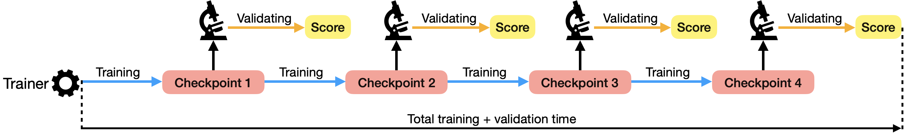

# Asyncval
Asyncval: A toolkit for asynchronously validating dense retriever checkpoints during training.

Validating dense retriever checkpoints during training is time-consuming. Asyncval is a toolkit that aims to accelerate this process. Asyncval decouples the validation loop from the training loop, uses another GPU to automatically validate new DR checkpoints generated during training, and thus permits to perform validation asynchronously from training.



## Installation
For customized dense retriever encoders, clone this repo and install as editable,

```
git clone https://github.com/ielab/asyncval.git
cd asyncval
pip install --editable .
```
> Note: The current code base has been tested with, `torch==1.10.0`, `transformers==4.5.1`, `datasets==1.16.1`, `faiss-cpu==1.7.1`, `python==3.7`