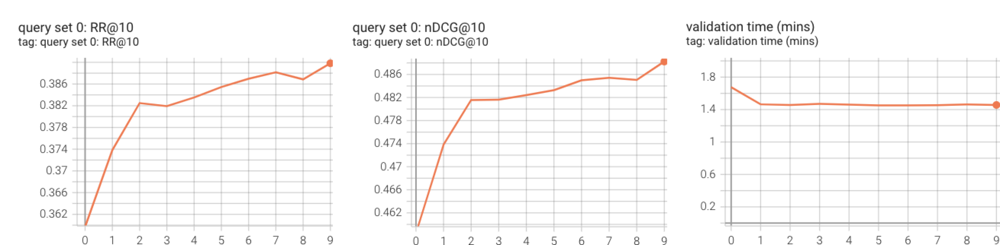

# MS MARCO Passage Ranking Example

In this example, we use Asyncval to validate dense retreiver ckeckpoints generated by [Tevatron](https://github.com/texttron/tevatron) training toolkit.

## Pretokenize Query and Corpus Files
Run: `bash get_data.sh`

This downloads the cleaned corpus and dev queries of MS MARCO passage ranking dataset, and the query and corpus files will be pretokenized into the required JSON format.

## Start Tevatron Training
First, follow the instructions in this Tevatron [example](https://github.com/texttron/tevatron/blob/main/examples/example_msmarco.md) to start training. You don't need to do the encoding and search steps.

## Sample Corpus Subset
(if you want to validate with the full corpus, skip this step)

Conducting retrieval validation against the full corpus is very slow. To speed up validation time for each checkpoint without loss validation accuracy, we can first sample a subset of corpus based on a given run file and the qrel file which provides gold (relevant) passages for each query in the validation set.

To have a run file, you can use [Pyserini](https://github.com/castorini/pyserini) IR toolkit to get a MS MARCO dev query run file. In this example we use [TCT-ColBERTv2](https://github.com/castorini/pyserini/blob/master/docs/experiments-distilbert_tasb.md) as our base DR model to generate the run file.

After getting the run file, run the following command to create the corpus subset:

```
python3 -m asyncval.splitter \
--candidate_dir ./marco/bert/corpus/ \
--run_file path/to/run.msmarco-passage.distilbert-dot-tas_b-b256.bf.tsv \
--qrel_file path/to/qrels.dev.small.tsv \
--output_dir ./marco/bert/corpus_tctv2_subset_top10/ \
--depth 10 \
--num_splits 5 \
--cache_dir cache
```
> Note: download the `qrels.dev.small.tsv` from MS MARCO offical [GitHub](https://github.com/microsoft/MSMARCO-Passage-Ranking)


## Start Asyncval Validation

Once you kick off tevatron trainig and get corpus subset prepared, you can directly start asyncval validation with the following command:

```
python -m asyncval \
--query_file ./marco/bert/query/dev.query.json \
--candidate_dir ./marco/bert/corpus_tctv2_subset_top10 \
--ckpts_dir ../retriever_model \
--tokenizer_name_or_path bert-base-uncased \
--qrel_file path/to/qrels.dev.small.tsv \
--metrics RR@10 nDCG@10 \
--output_dir ./tevatron_retriever_model \
--report_to tensorboard \
--logging_dir ./logs/tevatron_retriever_model \
--depth 10 \
--per_device_eval_batch_size 64 \
--fp16 \
--cache_dir cache
```
> Note: if you validating with the full corpus, change `--candidate_dir ./marco/bert/corpus_tctv2_subset_top10` to `--candidate_dir .marco/bert/corpus/`

The following are the retrieval validation results on tensorboard:

